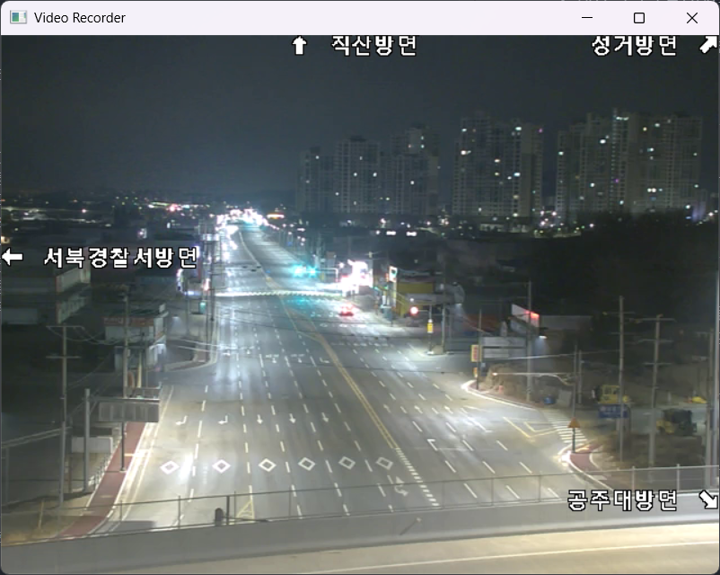
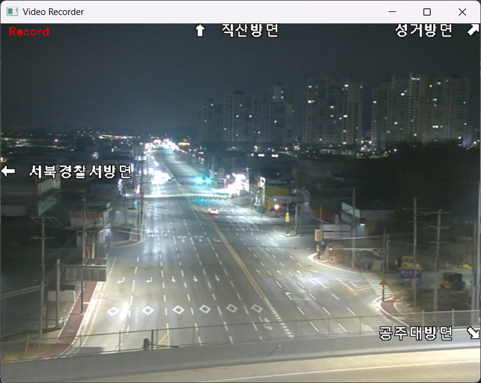
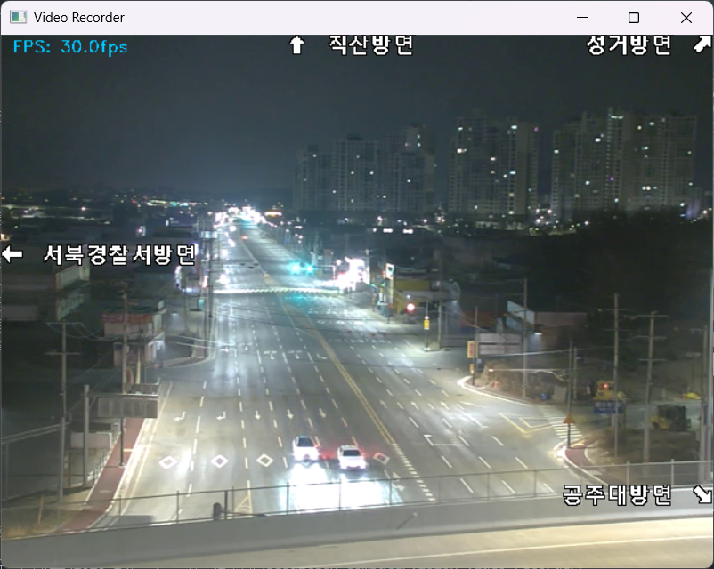
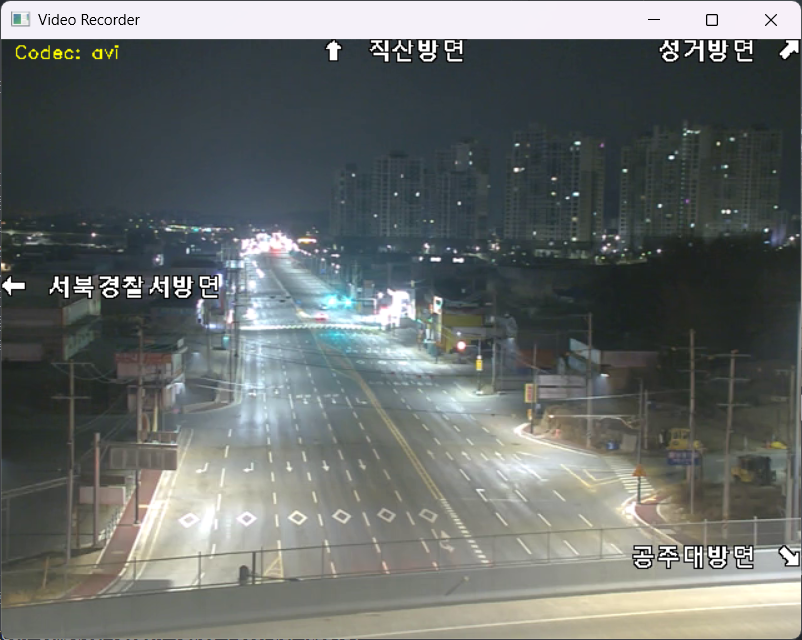
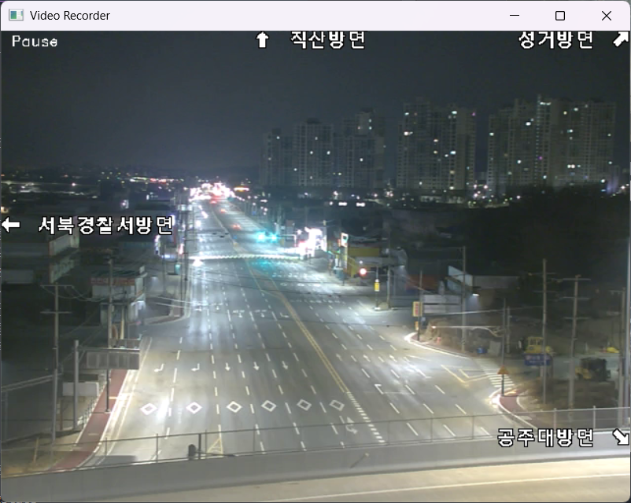

# seoultech-computervision-video-recorder

컴퓨터비전 2주차 과제용 비디오 재생/녹화 프로그램입니다.

## 기능

각 기능의 오버레이를 화면에 표시한다.

- **CCTV의 RTSP 스트림을 재생하여 화면에 출력** - `Preview`

- **녹화 시작/종료 및 저장** - `Record`

- **주사율 변경 가능** - `12fps`, `24fps`, `30fps`, `60fps`, `120fps`

- **저장 파일의 확장자/코덱 변경 가능** - `.avi`, `.mp4`, `.mov`

- **동영상 정지 기능** - `Pause`

## 실행 파일

- `app.py`
- (`main.py`는 더 이상 사용하지 않음)

## 키 조작

- `Esc`: 프로그램 종료
- `Space`: 녹화 시작/종료 및 저장
- `C`/`c`: 코덱 변경 모드 토글
- `F`/`f`: FPS 변경 모드 토글
- `P`/`p`: 일시정지 모드 토글
- `-`/`_`: 이전 값
- `=`/`+`: 다음 값

## 저장 파일

- 저장 폴더: `./records`
- 파일명 형식: `%Y-%m-%d %H-%M-%S.확장자`
- 확장자(코덱): `avi(XVID)`, `mp4(mp4v)`, `mov(MJPG)`
